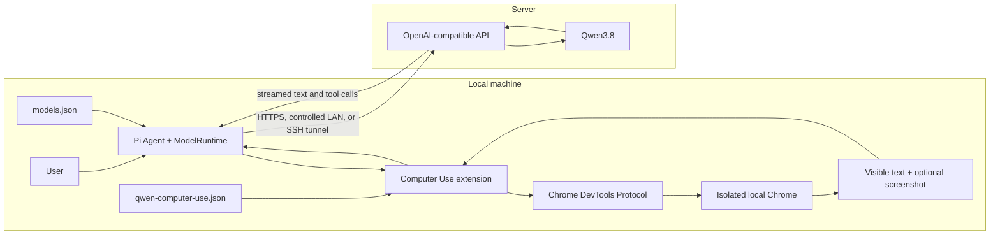

# Qwen3.8 remote inference with local Computer Use

## Goal

Run Pi and Computer Use on the local machine while Qwen3.8 runs on a server:

```text
local prompt + local browser observation
  -> remote Qwen3.8 inference
  -> tool call
  -> local browser execution
  -> local text and optional screenshot
  -> remote Qwen3.8 continuation
```

The server only performs inference and returns text or tool calls. Pi owns the
conversation, tool dispatch, timeout and abort behavior. The Computer Use
extension owns the local browser, page observations, input execution, and
cleanup.

The Full-Duplex CUA demo is only a reference for the server's OpenAI-compatible
request shape and known working sampling values. This implementation does not
copy its web UI, Xvfb desktop, Python runner, `pyautogui` loop, `cli_command`, or
sent-state verifier.

## Architecture



## Service call implementation

The first implementation uses Pi's existing model path instead of adding a
second HTTP client. Model service configuration stays in `models.json`; local
browser policy stays in `qwen-computer-use.json` so endpoint credentials and
navigation permissions remain separate:

1. Configure `qwen-cua-server` in the project-local
   `.pi/qwen-computer-use/models.json`.
2. Start Pi with the Qwen provider/model and load the Computer Use extension.
3. The extension injects visible page text and, when enabled, a screenshot from
   an isolated local Chrome instance.
4. `packages/ai` sends the prompt, observation, and tool schema through
   `openai-completions`.
5. Pi assembles streamed tool-call deltas and validates the arguments.
6. The extension executes the tool call through local CDP and returns text plus
   a new screenshot.
7. Pi sends the text result and optional screenshot back through the same
   conversation.

`models.json` does not interpolate environment variables in `baseUrl`, so the
URL must be a literal that is reachable from the local machine. `apiKey` does
support environment interpolation.

The deployment verified on 2026-08-31 is:

| Item | Verified value |
| --- | --- |
| SSH host | `cytoai-rf-h20-10` |
| Server endpoint | `http://127.0.0.1:18001/v1` on H20-10 |
| Local forwarded endpoint | `http://127.0.0.1:18001/v1` |
| Selected model | `Qwen3.8-27B-phase1-lora` |
| Parent model context | `16384` tokens |
| Maximum configured output | `12288` tokens, clamped to available context per request |
| Authentication | `EMPTY`, only through the private SSH tunnel |

The LoRA entry reports no separate `max_model_len`; the local configuration
therefore uses the parent model's advertised `16384`-token limit.

The checked-in `.pi/qwen-computer-use/models.json` contains this provider:

```json
{
  "providers": {
    "qwen-cua-server": {
      "baseUrl": "http://127.0.0.1:18001/v1",
      "api": "openai-completions",
      "apiKey": "$QWEN38_API_KEY",
      "compat": {
        "supportsDeveloperRole": false,
        "supportsReasoningEffort": false,
        "supportsUsageInStreaming": false,
        "maxTokensField": "max_tokens"
      },
      "models": [
        {
          "id": "Qwen3.8-27B-phase1-lora",
          "name": "Qwen3.8 CUA Server",
          "reasoning": false,
          "input": ["text", "image"],
          "contextWindow": 16384,
          "maxTokens": 12288,
          "samplingParams": {
            "temperature": 0.01,
            "top_p": 0.8,
            "chat_template_kwargs": {
              "enable_thinking": false,
              "preserve_thinking": false
            }
          }
        }
      ]
    }
  }
}
```

The model ID and context limit above were read from the live `/v1/models`
response. The sampling values and disabled thinking mode were then validated by
a live screenshot prompt. `EMPTY` is acceptable only through the private SSH
tunnel. Do not expose the unauthenticated vLLM port to the public internet.

## Context limits and compaction

The primary hard limit is the vLLM `--max-model-len 16384` setting. The local
`contextWindow: 16384` must match it. `maxTokens: 12288` shares this context with
the system prompt, tool schemas, conversation, page observations, and images;
it does not increase the total capacity. Before provider serialization, Pi
also reserves 4096 safety tokens and clamps the requested output to the
remaining capacity.

Pi has automatic context compaction. Its repository defaults are
`reserveTokens: 16384` and `keepRecentTokens: 20000`, which are intended for
larger context windows and cannot produce a useful cut for this 16K model. The
Qwen agent directory therefore contains this checked-in `settings.json`:

```json
{
  "compaction": {
    "enabled": true,
    "reserveTokens": 4096,
    "keepRecentTokens": 4096
  }
}
```

This triggers compaction near an estimated 12K-token context, summarizes older
messages, and retains about 4K recent tokens. The provider declares
`supportsUsageInStreaming: false`, and the observed streamed responses report
zero input/output usage. Pi consequently uses its local text/image estimate for
threshold checks. If the server returns `finish_reason: "length"`, Pi exposes
it as a truncated response and makes a bounded compact-and-retry attempt.

Previous failures contained four screenshots, no compaction checkpoint, and a
final `stopReason: "length"`. Their pre-change `keepRecentTokens: 20000`
prevented the compaction preparation step from finding older content to
summarize. After changing these settings, use a new session when practical so
large historical observations do not need to be recovered first.

## Verified startup

Keep the tunnel running in terminal 1:

```bash
ssh -N \
  -L 18001:127.0.0.1:18001 \
  -o ExitOnForwardFailure=yes \
  -o ServerAliveInterval=30 \
  cytoai-rf-h20-10
```

Confirm the local endpoint before starting Pi:

```bash
curl --fail --silent --show-error \
  -H "Authorization: Bearer EMPTY" \
  http://127.0.0.1:18001/v1/models
```

The project-local `.pi/qwen-computer-use/qwen-computer-use.json` opens an
isolated, visible local Chrome window at `example.com`, allows Google and
Baidu, and keeps site data in a dedicated profile:

```json
{
  "userDataDir": "browser-profile",
  "sendScreenshots": false,
  "startUrl": "https://example.com",
  "allowedOrigins": [
    "https://example.com",
    "https://google.com",
    "https://www.google.com",
    "https://www.baidu.com",
    "https://wappass.baidu.com"
  ],
  "headless": false
}
```

`sendScreenshots` controls browser image transmission. `false` sends URL,
title, viewport, page list, and visible page text without an image. `true`
includes a JPEG screenshot. `PI_CUA_SEND_SCREENSHOTS=true|false` overrides the
JSON value for the current process and has higher priority.

## Image transport and request retention

When enabled, image data follows this path:

```text
Chrome CDP JPEG capture
  -> Base64 BrowserObservation.screenshot
  -> { type: "image", data, mimeType: "image/jpeg" }
  -> OpenAI image_url with data:image/jpeg;base64,...
  -> JSON POST to /v1/chat/completions
  -> local port 18001 through the SSH tunnel
  -> remote vLLM/Qwen
```

The request embeds Base64 in JSON instead of uploading a file or using
multipart form data. Base64 increases the JPEG byte size by approximately 33%.
The configured endpoint uses local plain HTTP, but the documented SSH port
forward encrypts the traffic between the local machine and H20-10. Directly
exposing the HTTP endpoint would not provide that protection.

The extension registers a `context` hook before provider serialization. It
identifies hidden `computer-use-observation` messages and `computer_use` tool
results, removes image blocks from all older observations, and leaves at most
the latest browser-state screenshot. User-attached images are not filtered.
The hook receives a deep copy, so this only changes the outgoing model context;
the append-only session JSONL can still contain the original historical image
data. If the newest observation is text-only, all historical Computer Use
screenshots are omitted. With the active `sendScreenshots: false` setting, the
browser does not capture or transmit screenshots at all.

Run Pi from the repository root in terminal 2:

```bash
export QWEN38_API_KEY=EMPTY
export PI_CODING_AGENT_DIR="$PWD/.pi/qwen-computer-use"
export PI_CODING_AGENT_SESSION_DIR=/private/tmp/pi-qwen-cua-sessions

./pi-test.sh \
  -e packages/coding-agent/examples/extensions/qwen-computer-use/index.ts \
  --provider qwen-cua-server \
  --model Qwen3.8-27B-phase1-lora
```

After the TUI starts, enter a normal request, for example:

```text
Observe the current page. Describe its title and main text without changing anything.
```

The 2026-08-31 project-local smoke run sent Baidu screenshots through Pi to the
remote model. The model clicked the search field, typed `cybopal`, pressed
Enter, and observed the next page. Baidu redirected the isolated browser to its
security verification page, so the run could not read search results, but Pi
remained alive and continued issuing `computer_use` calls without an uncaught
CDP timeout. This separates the remaining site CAPTCHA from the fixed runtime
failure.

For another target, set both `startUrl` and its exact origin in
`allowedOrigins`; include the port when it is not the scheme default. Stop Pi
and the tunnel with `Ctrl+C` in their respective terminals. Pi session shutdown
closes its isolated Chrome.

## V1 scope

The first vertical slice is a loadable extension under
`packages/coding-agent/examples/extensions/qwen-computer-use/`.

It provides one sequential `computer_use` tool with these browser-scoped
actions:

- `screenshot`
- `list_pages`
- `switch_page`
- `navigate`
- `left_click`
- `double_click`
- `type`
- `key`
- `scroll`

Coordinates use the Qwen CUA convention `[0, 1000]` and are scaled to the
current CSS viewport locally. Every action returns a fresh observation with up
to 12,000 characters of visible page text. Screenshots are optional; coordinate
clicks are less reliable in text-only mode.

Chrome starts lazily with:

- the configured dedicated persistent profile, or a temporary profile when
  `userDataDir` is omitted;
- visible page text and optional JPEG screenshots;
- remote debugging bound to loopback;
- a fixed viewport and device scale factor;
- no access to the user's normal Chrome profile or cookies unless that profile
  is explicitly and unsafely selected as `userDataDir`;
- an origin allowlist, defaulting to `http://127.0.0.1` and
  `http://localhost` only.

The verified model and browser configuration now lives under
`.pi/qwen-computer-use/` instead of `/private/tmp`. Runtime sessions remain in
`/private/tmp/pi-qwen-cua-sessions`, and the directory's `.gitignore` excludes
other generated state. Browser configuration is loaded from
`$PI_CODING_AGENT_DIR/qwen-computer-use.json`, or
`~/.pi/agent/qwen-computer-use.json` when `PI_CODING_AGENT_DIR` is unset. An
explicit `PI_CUA_CONFIG_PATH` selects another file. Environment variables take
precedence over JSON values:

| JSON key | Environment override | Purpose | Default |
| --- | --- | --- | --- |
| — | `PI_CUA_CONFIG_PATH` | Explicit JSON config path | agent directory file |
| `browserExecutable` | `PI_CUA_BROWSER_EXECUTABLE` | Chrome/Chromium executable | platform discovery |
| `userDataDir` | `PI_CUA_USER_DATA_DIR` | Dedicated persistent Chrome profile; relative JSON paths resolve from the config file | temporary profile |
| `sendScreenshots` | `PI_CUA_SEND_SCREENSHOTS` | Attach JPEG screenshots to model observations | `true` |
| `startUrl` | `PI_CUA_START_URL` | Initial page | `about:blank` |
| `allowedOrigins` | `PI_CUA_ALLOWED_ORIGINS` | Exact top-level navigation allowlist; environment value is comma-separated | loopback HTTP origins |
| `headless` | `PI_CUA_HEADLESS` | Use headless Chrome | `false` |

The JSON parser rejects unknown keys and invalid types. A persistent profile
keeps persistent cookies across Pi restarts, so a manually completed Baidu
verification can be reused, but it cannot guarantee that Baidu will not ask
again. The profile directory must not be committed or shared with the user's
normal Chrome profile. Navigation waits for
`Page.domContentEventFired` instead of a full page load. If that event still
exceeds the CDP request timeout, the extension handles its rejection immediately
even while `Page.navigate` is pending, then continues with the current
observation; allowlist and CDP protocol errors still fail. The allowlist checks
only the selected page's top-level frame. Embedded frames and page resources are
not navigation authority and may use other origins. A live Baidu trace showed
`https://wappass.baidu.com` as a main-frame intermediate navigation, so it must
be explicitly allowlisted rather than treated as an embedded frame.

The extension does not execute shell commands, arbitrary JavaScript, filesystem
operations, or OS-wide mouse and keyboard input. Browser content and tool calls
are treated as untrusted input.

## Implementation phases

### Phase 0: Local-to-remote service path

- Establish a controlled LAN, HTTPS gateway, or SSH tunnel.
- Verify `/v1/models` from the local machine.
- Verify Pi streamed text, one harmless tool call, image input, and tool-result
  continuation.
- Record failures as network, authentication, stream parsing, message layout,
  or model behavior.

Exit: local Pi receives a complete remote tool call and sends a local result
screenshot back without running a browser on the server.

### Phase 1: Local browser vertical slice

- Launch isolated Chrome lazily.
- Inject the initial local page observation before the first model call.
- Execute the browser-scoped tool actions sequentially.
- Return fresh visible page text and an optional screenshot after every action.
- Close Chrome and remove only an extension-created temporary profile on
  session shutdown; preserve a configured `userDataDir`.

Exit: the model can observe a local fixture page, click or type once, and verify
the resulting local page state.

### Phase 2: Hardening after server validation

- Compare Pi's streamed tool calls with the actual server.
- Test Pi's separate follow-up user image for tool-result screenshots.
- Add a narrow `openai-completions` compatibility option only if the server
  proves it is required.
- Add confirmation and state-verification policies before using authenticated
  browser profiles or destructive website actions.

## Verification

- Unit: coordinate scaling, origin validation, argument validation, sequential
  tool registration, and text-only/optional-screenshot result shapes.
- Browser integration: isolated Chrome starts, loads a loopback fixture, accepts
  a local click/type action, returns visible text with or without a screenshot,
  tolerates a slow page event, ignores cross-origin subframe loads for top-level
  navigation policy, and shuts down.
- Provider contract: opt-in live Qwen test for streamed tool calls and image
  continuation; never runs in uncredentialed CI.
- Repository: focused Vitest files followed by `npm run check`.

## Open environment facts

- Local-reachable Qwen base URL and authentication method.
- Exact `/v1/models` model ID.
- Serving stack/version, chat template, and tool-call parser.
- Whether the first live task targets an isolated browser or an explicitly
  approved existing browser session.
